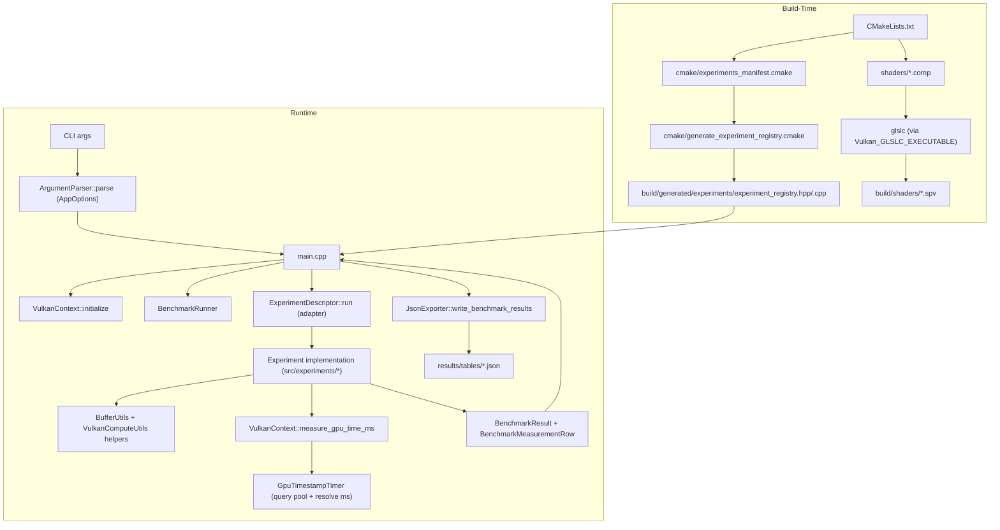

# Project Architecture

This document describes how the project is structured and how execution flows from CLI input to Vulkan execution and JSON output.

## Scope

- **Primary runtime binary**: `gpu_memory_layout_experiments`
- **Core purpose**: run reproducible Vulkan compute experiments and export benchmark data.
- **Current experiment integration model**: generated experiment registry + per-experiment adapters.

## High-Level Diagram

## Runtime Flow

1. `src/main.cpp` loads enabled experiment ids from the generated registry and parses CLI options.
2. `VulkanContext` creates Vulkan instance/device/queue/command resources and initializes `GpuTimestampTimer` when supported.
3. Main loop resolves each selected experiment descriptor and invokes its adapter.
4. Adapter converts generic app options to experiment-specific config and calls experiment implementation.
5. Experiment implementation:
   - creates pipelines/buffers/descriptors using utility helpers,
   - records command buffers,
   - uses `VulkanContext::measure_gpu_time_ms(...)` for GPU timing,
   - validates outputs and produces summary + per-iteration rows.
6. Main aggregates all experiment outputs and writes final JSON using `JsonExporter`.

## Main Modules and Responsibilities

- `src/main.cpp`
  - process orchestration
  - experiment dispatch
  - final export
- `src/vulkan_context.cpp`
  - Vulkan lifetime ownership
  - queue/command resource management
  - timed command submission API for experiments
- `src/utils/gpu_timestamp_timer.cpp`
  - timestamp query pool creation/reset/resolve
  - nanosecond-to-millisecond conversion
- `src/benchmark_runner.cpp`
  - warmup + timed loops
  - sample summarization (avg/min/max/median/p95)
- `src/experiments/*`
  - experiment-specific pipeline logic, correctness checks, and measurements
- `src/experiments/adapters/*`
  - bridge from generic app options to experiment-specific config/output
- `build/generated/experiments/experiment_registry.*`
  - compile-time generated registry of available experiments
- `src/utils/json_exporter.cpp`
  - schema-based JSON output (metadata + summary + optional row-level data)

## Build-Time Generation Model

- Experiment registration is not hardcoded in `main.cpp`.
- CMake consumes `cmake/experiments_manifest.cmake` and templates to generate registry files in `build/generated/experiments/`.
- Shader sources in `shaders/` are compiled to SPIR-V in `build/shaders/` during build when shader compilation is enabled.

## Data Contracts

- `BenchmarkResult`: aggregated metrics for one named benchmark case.
- `BenchmarkMeasurementRow`: per-iteration/per-variant measurement with correctness and throughput fields.
- `ExperimentRunOutput`: adapter-level payload containing summary results, optional rows, success flag, and error message.

## Failure and Validation Strategy

- Vulkan and IO failures are surfaced as explicit `false`/`NaN` returns and logged to `std::cerr`.
- Experiments report correctness per point and propagate failure to the top-level runner.
- Top-level process exits non-zero on parse, initialization, experiment execution, or export failure conditions.

## Extension Workflow (Add a New Experiment)

1. Implement experiment logic under `include/experiments/` and `src/experiments/`.
2. Add an adapter under `src/experiments/adapters/` with `ExperimentRunFn` signature.
3. Register the experiment in `cmake/experiments_manifest.cmake`.
4. Reconfigure/build so registry files are regenerated.
5. Add/compile shader assets if required.
6. Validate output rows/results and JSON export.
