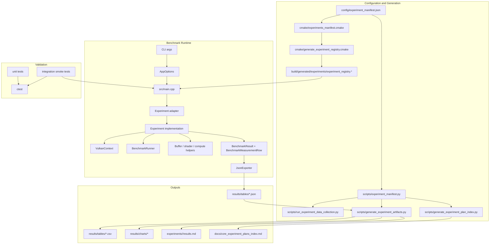

# Project Architecture

This project is a Vulkan compute benchmarking platform for GPU memory-access research.
As of April 6, 2026, the repository contains 33 experiments, a manifest-driven registration model, raw data collection scripts, artifact generation scripts, and GPU smoke-test coverage.

## Architecture Goals

- Keep benchmark execution reproducible and machine-readable.
- Separate platform concerns from experiment-specific logic.
- Use one shared source of truth for experiment registration.
- Make build, collection, artifact generation, and documentation move together.
- Keep Vulkan lifetime, timing, and synchronization explicit.

## System Overview

## Architectural Layers

### 1. Manifest and Generation Layer

Files:
- `config/experiment_manifest.json`
- `cmake/experiments_manifest.cmake`
- `scripts/experiment_manifest.py`
- `scripts/generate_experiment_plan_index.py`

Responsibilities:
- define experiment identity, source files, adapter files, analysis scripts, and documentation metadata
- drive build registration and script registration from one manifest
- remove manual duplication between CMake, Python tooling, and docs indexes

Key rule:
- adding an experiment starts in the manifest, not in scattered hardcoded lists

### 2. Runtime Orchestration Layer

Files:
- `src/main.cpp`
- `include/utils/app_options.hpp`
- `src/utils/app_options.cpp`
- generated `experiment_registry.*`

Responsibilities:
- parse CLI options
- select experiments
- initialize Vulkan once per run
- invoke registered experiment adapters
- aggregate and export outputs

Key rule:
- runtime orchestration should remain generic; experiment-specific policy belongs in adapters or implementations

### 3. Adapter Layer

Files:
- `src/experiments/adapters/*`

Responsibilities:
- translate generic CLI options into experiment config
- preserve shared semantics such as total scratch budget, iteration counts, and verbose progress
- call experiment implementations through a consistent adapter contract

Key rule:
- adapters are thin translation layers, not alternate experiment implementations

### 4. Experiment Implementation Layer

Files:
- `include/experiments/*`
- `src/experiments/*`
- `shaders/<experiment_id>/*`

Responsibilities:
- own experiment-specific buffer layout, shader dispatch, correctness validation, and per-case note generation
- produce `BenchmarkResult` summaries plus row-level measurements
- keep measurement logic local to the experiment being evaluated

Key rule:
- experiments own correctness and interpretation inputs; shared utilities own mechanics

### 5. Shared Runtime Utilities Layer

Files:
- `src/vulkan_context.cpp`
- `src/utils/buffer_utils.cpp`
- `src/benchmark_runner.cpp`
- `src/utils/gpu_timestamp_timer.cpp`
- `src/utils/json_exporter.cpp`
- `src/utils/vulkan_compute_utils.cpp`

Responsibilities:
- Vulkan device/queue/command ownership
- timestamp timing
- buffer and shader loading helpers
- warmup and timed-loop execution
- JSON schema export

Key rule:
- utility code should be reusable, deterministic, and free of experiment-specific assumptions

### 6. Validation and Reporting Layer

Files:
- `tests/unit/*`
- `tests/integration/*`
- `scripts/run_experiment_data_collection.py`
- `scripts/generate_experiment_artifacts.py`
- `experiments/<id>/results.md`

Responsibilities:
- protect utility behavior with unit tests
- exercise representative experiments with GPU smoke tests
- run full data collection and artifact generation from raw outputs
- keep per-experiment results pages aligned with generated tables and charts

Key rule:
- raw outputs are the source record; charts and written reports are derived artifacts

## Directory Structure

- `config/`
  - manifest and shared configuration inputs
- `cmake/`
  - registry generation and build-time helpers
- `include/`
  - public declarations for shared runtime and experiments
- `src/`
  - runtime implementations, experiment implementations, and adapters
- `shaders/`
  - one canonical shader set per experiment
- `scripts/`
  - collection, generation, and tooling automation
- `experiments/`
  - per-experiment local `README.md`, `results.md`, run archives, tables, charts, and helper scripts
- `docs/`
  - architecture, canonical experiment plans, program plans, methodology, and feature notes
- `tests/`
  - unit and integration coverage

## Build-Time Flow

1. CMake reads `config/experiment_manifest.json` through `cmake/experiments_manifest.cmake`.
2. Source and adapter lists are assembled from the manifest.
3. `cmake/generate_experiment_registry.cmake` generates the compile-time experiment registry.
4. Shader sources under `shaders/` are compiled to SPIR-V when shader compilation is enabled.
5. The benchmark binary and test targets are built from the same registered experiment set.

## Runtime Flow

1. The CLI parses experiment selection, scratch budget, iteration counts, and output settings.
2. `main.cpp` loads experiment descriptors from the generated registry.
3. `VulkanContext` initializes the Vulkan instance, device, queue, command resources, and timestamp support.
4. Each selected adapter converts shared runtime options into experiment-specific config.
5. The experiment implementation creates resources, records dispatches, validates correctness, and captures timing.
6. The runtime aggregates all returned rows and summaries.
7. `JsonExporter` writes the raw benchmark export.
8. Post-processing scripts generate tables, charts, and `results.md` summaries from the raw export.

## Data Contracts

- `BenchmarkResult`
  - aggregated metrics for one benchmark case
- `BenchmarkMeasurementRow`
  - row-level measurement, correctness, metadata, and notes for one case
- `ExperimentRunOutput`
  - adapter return object containing results, optional rows, success state, and error text

Shared metadata expectations:
- `scratch_size_bytes` is the total CLI scratch budget
- per-buffer or internal allocation limits should be recorded separately in notes
- correctness must be validated before performance comparisons are treated as valid

## Testing Architecture

The test strategy is layered:

- Unit tests cover utility code such as option parsing, metrics, JSON export, scratch-budget helpers, and Vulkan helper logic.
- Integration smoke tests validate the benchmark binary and run a representative experiment matrix on real Vulkan execution when GPU integration tests are enabled.
- Full benchmark collection remains a separate workflow because it is slower, hardware-dependent, and produces report artifacts rather than pass/fail checks.

## Extension Workflow

To add a new experiment:

1. Add the experiment entry to `config/experiment_manifest.json`.
2. Implement the experiment under `include/experiments/`, `src/experiments/`, and `shaders/<id>/`.
3. Add the adapter under `src/experiments/adapters/`.
4. Reconfigure and build so registry files regenerate.
5. Run unit tests plus GPU smoke tests.
6. Collect raw benchmark data.
7. Regenerate derived artifacts and update `experiments/<id>/results.md`.

## Experiment Documentation Policy

Canonical experiment specifications live in `docs/experiment_plans/`.

Experiment folders should stay lightweight:

- keep `README.md` as a thin local index
- keep `results.md` as the experiment-local measured report
- keep generated artifacts under `results/`
- keep archived exports under `runs/`
- keep experiment-local helper notes only when they are specific to local scripts or artifact workflow

Do not duplicate repo-wide architecture, development planning, or implementation planning inside each experiment directory.

## Planned Architectural Refinements

The next structural improvements should focus on shared-library quality:

- extract a reusable experiment-run harness for warmup/timed loops, row creation, and note assembly
- introduce shared RAII bundles for buffers, descriptor sets, and compute pipelines used repeatedly across experiments
- formalize a shared scratch-budget metadata helper so total budget and internal allocation limits cannot drift
- keep all experiment registration and docs generation manifest-driven
