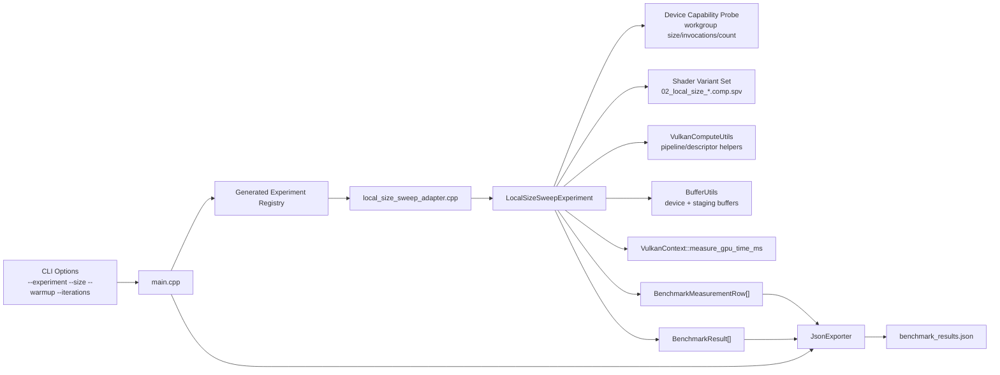
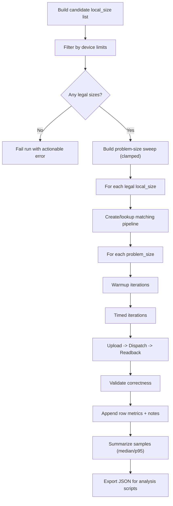
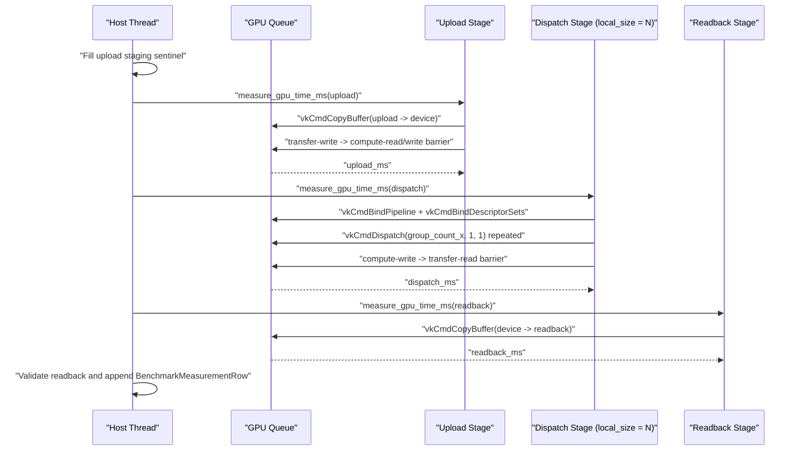
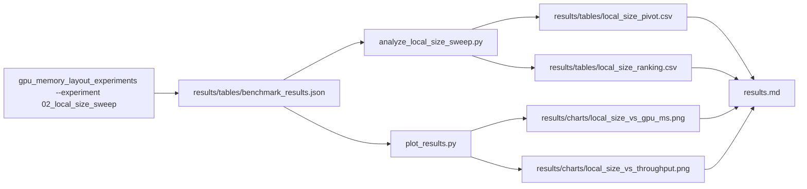

# Experiment 02 Architecture

## 1. Purpose
Experiment 02 extends the baseline harness with a controlled sweep over legal `local_size_x` values while keeping kernel logic, memory layout, and synchronization behavior fixed.

Primary architectural goals:
- isolate local-size effects without changing algorithm semantics
- keep correctness checks mandatory for every measured row
- preserve explicit Vulkan ownership and teardown rules
- produce reproducible row-level data for post-run analysis

## 2. Runtime Component Architecture

## 3. Resource Ownership Model
Per active local-size variant:
- shader module
- descriptor set layout
- descriptor pool + descriptor set
- pipeline layout
- compute pipeline

Shared across variants:
- device-local storage buffer
- upload staging buffer
- readback staging buffer

Ownership rule:
- experiment function creates and destroys resources
- destruction runs in strict reverse creation order
- all destroyed Vulkan handles are reset to `VK_NULL_HANDLE`

## 4. Sweep Execution Flow

## 5. Per-Iteration Command Sequence

## 6. Data and Analysis Pipeline

## 7. Key Architectural Constraints
- Candidate local sizes must be filtered before dispatch recording.
- Synchronization remains explicit and local to each phase.
- Correctness is a hard gate for interpreting performance data.
- Result encoding must preserve enough metadata to compare local sizes reliably.
