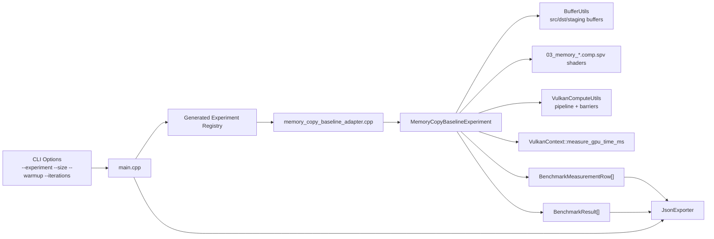
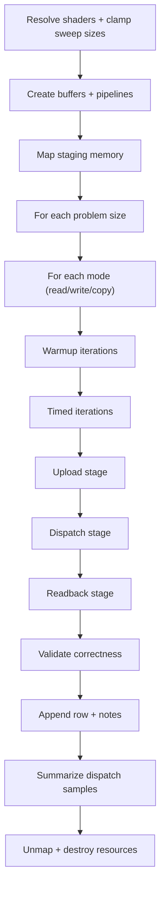
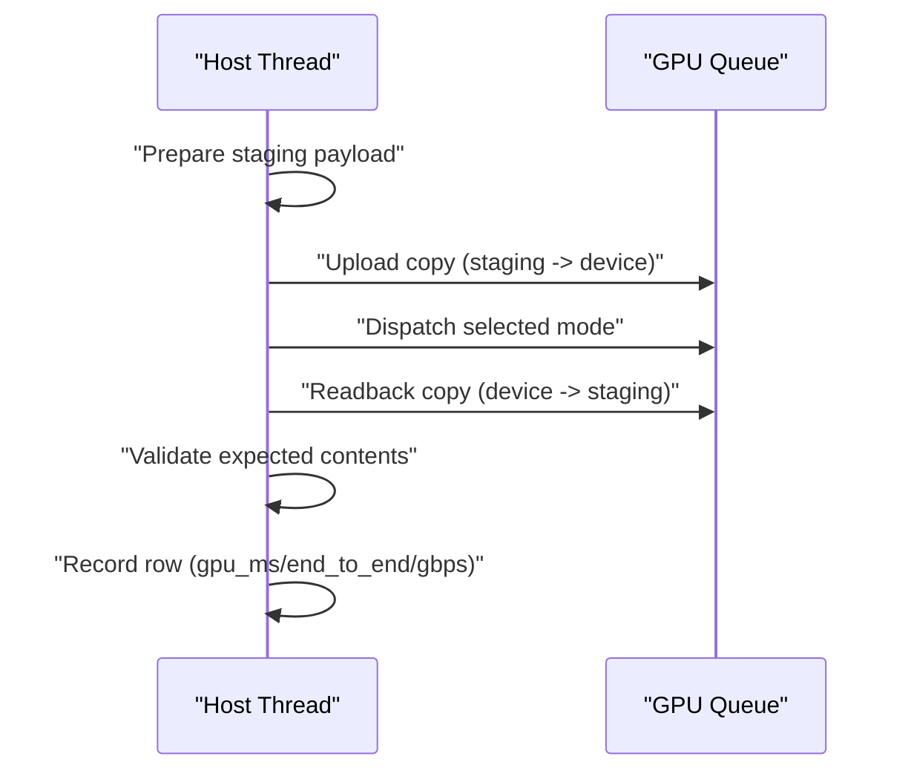
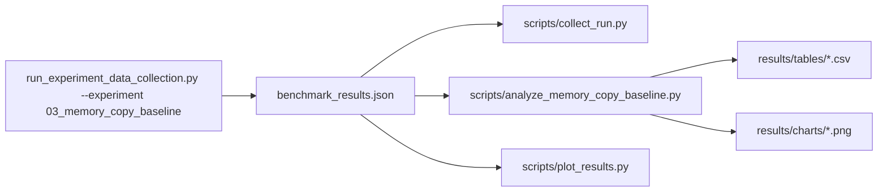

# Experiment 03 Architecture

## 1. Purpose
Experiment 03 measures raw memory-path behavior with tightly scoped kernels:
- read-only memory traffic
- write-only memory traffic
- read+write copy traffic

The architecture keeps synchronization explicit and correctness mandatory before interpreting throughput.

## 2. Runtime Component Architecture

## 3. Resource Ownership Model
Shared buffers:
- `src_device` (device-local storage + transfer)
- `dst_device` (device-local storage + transfer)
- `staging` (host-visible transfer src/dst)

Per-mode pipeline resources:
- shader module
- descriptor set layout
- descriptor pool + descriptor set
- pipeline layout
- compute pipeline

Ownership rule:
- experiment function creates and destroys all resources
- teardown is reverse-order
- handles are reset to `VK_NULL_HANDLE`

## 4. Execution Flow

## 5. Per-Iteration Command Sequence

## 6. Data and Analysis Pipeline

