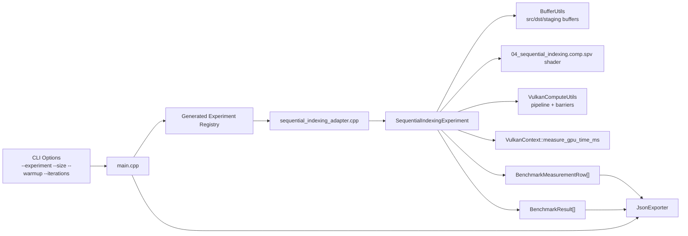
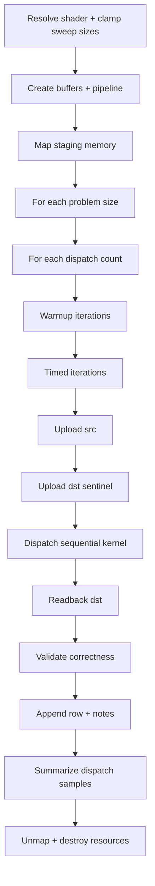
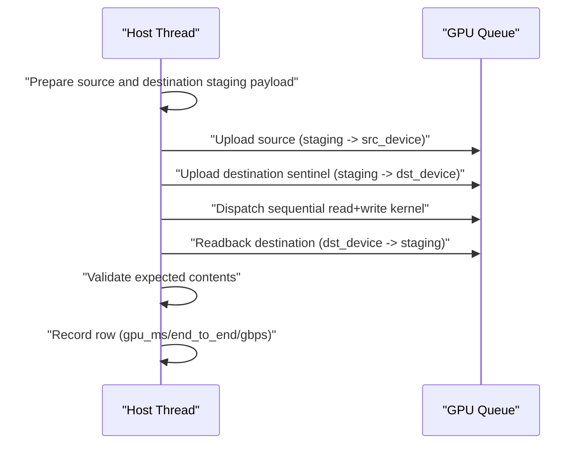
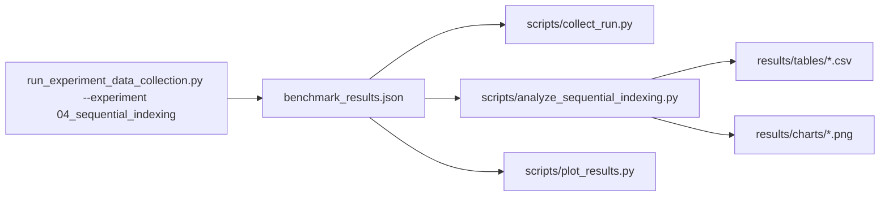

# Experiment 04 Architecture

## 1. Purpose
Experiment 04 measures contiguous thread-to-data mapping in a simple read+write kernel:
- source read at index `i`
- destination write at index `i`
- deterministic transform for correctness validation

This experiment establishes a strong baseline before non-sequential mapping studies.

## 2. Runtime Component Architecture

## 3. Resource Ownership Model
Shared buffers:
- `src_device` (device-local storage + transfer)
- `dst_device` (device-local storage + transfer)
- `staging` (host-visible transfer src/dst)

Pipeline resources:
- shader module
- descriptor set layout
- descriptor pool + descriptor set
- pipeline layout
- compute pipeline

Ownership rule:
- experiment function creates and destroys all resources
- teardown is reverse-order
- handles are reset to `VK_NULL_HANDLE`

## 4. Execution Flow

## 5. Per-Iteration Command Sequence

## 6. Data and Analysis Pipeline

