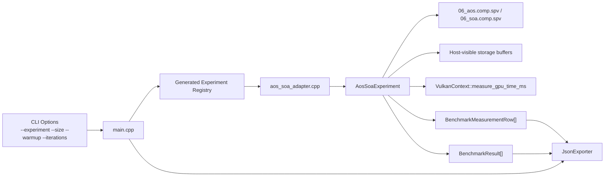
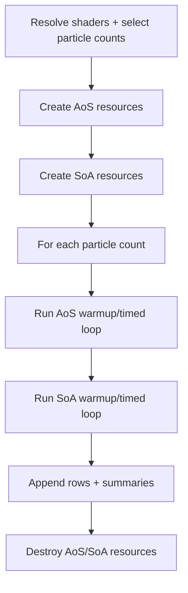

# Experiment 06 Architecture

## 1. Purpose
Experiment 06 compares two memory layouts for the same particle-update kernel:
- `aos`: array of packed structs
- `soa`: structure of arrays (8 bound float buffers)

Both variants execute the same arithmetic update to isolate layout effects.

## 2. Runtime Component Architecture

## 3. Ownership Model
- Experiment runtime owns all Vulkan objects created for AoS and SoA paths.
- Teardown is reverse-order and explicit.
- Handles are reset to `VK_NULL_HANDLE` after destruction.

## 4. Execution Flow

## 5. Per-Iteration Logic
1. Fill deterministic seed values.
2. Dispatch one compute workload timed with GPU timestamps.
3. Validate output against CPU expected values.
4. Emit row metrics and notes.
