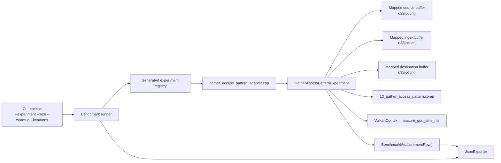
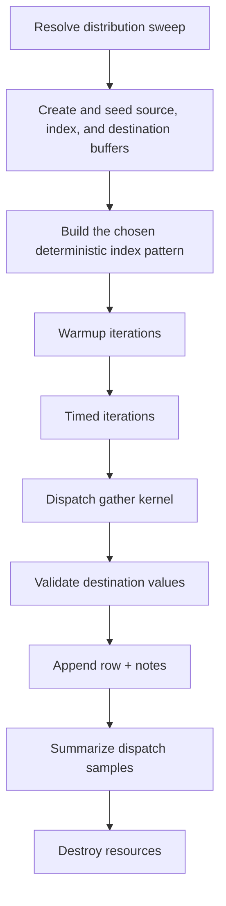

# Experiment 12 Gather Access Pattern: Runtime Architecture

## 1. Purpose
Experiment 12 characterizes indirect reads by varying the coherence of the source address stream while keeping the rest of the kernel stable.

The benchmark isolates read-side locality and coalescing:
- the destination write remains sequential
- arithmetic stays trivial
- dispatch shape stays fixed
- the only intended variable is the source access distribution

## 2. Draft Runtime Contract
The first implementation should use one parameterized compute shader and one host-generated index buffer per case.

Host-configured inputs:
- `count`: logical element count
- `distribution`: access-pattern family
- `seed`: deterministic generation seed
- `block_size`: optional grouping granularity for block-coherent variants
- `cluster_size`: optional grouping granularity for clustered-random variants

Recommended variant set:
- `identity`
- `block_coherent_32`
- `clustered_random_256`
- `random_permutation`

Distribution definitions:
- `identity`: `index[i] = i`
- `block_coherent_32`: the index range is partitioned into 32-element blocks; blocks are visited in a deterministic pseudo-random order, while indices within each block stay contiguous
- `clustered_random_256`: the index range is partitioned into 256-element clusters; clusters are visited in a deterministic pseudo-random order, and indices within each cluster are shuffled deterministically
- `random_permutation`: a full Fisher-Yates permutation of `[0, count)` driven by `seed`

Logical data model:
- element type: `u32`
- source buffer length: `count`
- index buffer length: `count`
- destination buffer length: `count`
- total logical bytes moved per element: `3 * sizeof(uint32_t)` for one source read, one index read, and one destination write
- total transient allocation: approximately `3 * count * sizeof(uint32_t)` plus any Vulkan alignment slack

Allocation rule:
- `max_buffer_bytes` is a per-buffer cap inherited from `--size`
- a candidate point is valid only if `count * sizeof(uint32_t) <= max_buffer_bytes` for each logical buffer
- if a point would exceed the cap, the host should skip it rather than silently shrink the logical work

Seeding rule:
- source values are deterministic for a given `count`
- index generation is deterministic for a given `(distribution, seed, count)`
- the same generated index buffer is reused for warmup and timed iterations
- destination padding, if any, is filled with a sentinel value and excluded from correctness checks

Per-invocation work:
- `logical_index = gl_GlobalInvocationID.x`
- return if `logical_index >= pc.count`
- `source_index = index_buffer.indices[logical_index]`
- `value = src_buffer.values[source_index]`
- `dst_buffer.values[logical_index] = value + 1u`

Validation model:
- destination values must match `src_buffer[index_buffer[i]] + 1u` exactly
- source and index buffers must remain unchanged
- integer comparison is exact; no tolerance is required

Measurement model:
- workgroup size: `256`
- dispatch count: `1` per timed sample
- `variant` should encode the distribution, for example `identity`, `block_coherent_32`, `clustered_random_256`, `random_permutation`
- `problem_size` in the output rows is the logical element count
- `gbps` should be derived from logical bytes moved, not from padded allocation size

## 3. Runtime Component Architecture


## 4. Resource Ownership Model
Pipeline resources:
- shader module
- descriptor set layout
- descriptor pool
- descriptor set
- pipeline layout
- compute pipeline

Buffer resources:
- one mapped source storage buffer
- one mapped index storage buffer
- one mapped destination storage buffer

Ownership rule:
- the experiment function creates and destroys all resources
- teardown is reverse-order
- Vulkan handles are reset to `VK_NULL_HANDLE`

## 5. Shader Layout
The shader should remain single-file and single-entry-point.

Recommended GLSL layout:
```glsl
#version 450

layout(local_size_x = 256, local_size_y = 1, local_size_z = 1) in;

layout(set = 0, binding = 0, std430) readonly buffer SourceBuffer {
    uint values[];
} src_buffer;

layout(set = 0, binding = 1, std430) readonly buffer IndexBuffer {
    uint indices[];
} index_buffer;

layout(set = 0, binding = 2, std430) writeonly buffer DestinationBuffer {
    uint values[];
} dst_buffer;

layout(push_constant) uniform PushConstants {
    uint count;
} pc;

void main() {
    uint logical_index = gl_GlobalInvocationID.x;
    if (logical_index >= pc.count) {
        return;
    }

    uint source_index = index_buffer.indices[logical_index];
    uint value = src_buffer.values[source_index];
    dst_buffer.values[logical_index] = value + 1u;
}
```

Shader layout rules:
- keep the index buffer host-generated so the shader only consumes the chosen distribution
- keep the arithmetic trivial so the memory access pattern dominates the measurement
- keep the destination write sequential so only the source-read locality changes across variants
- use exact integer validation for all runs
- avoid shared memory, atomics, subgroup ops, and extra control flow beyond the bounds check

## 6. Execution Flow


## 7. Timing and Metrics Semantics
Per measured point:
- `gpu_ms`: dispatch-stage GPU timestamp duration only
- `end_to_end_ms`: host wall-clock around seed, dispatch, and validation
- `throughput`: elements per second for the logical element count
- `gbps`: logical bytes moved per second, with `3 * sizeof(uint32_t)` per element

Warmup iterations:
- executed per `(variant, problem_size, dispatch_count)`
- timings are ignored and only used to stabilize pipeline and cache behavior

Timed iterations:
- one row is emitted per iteration
- a failed correctness check should flip the run-level success flag even if timing data was collected

## 8. Notes and Metadata
Per row notes should record:
- `distribution`
- `seed`
- `block_size`
- `cluster_size`
- `logical_elements`
- `physical_elements`
- `physical_span_bytes`
- `bytes_per_logical_element`
- `validation_mode`
- `skip_reason` when a candidate point is dropped by the buffer-cap check

