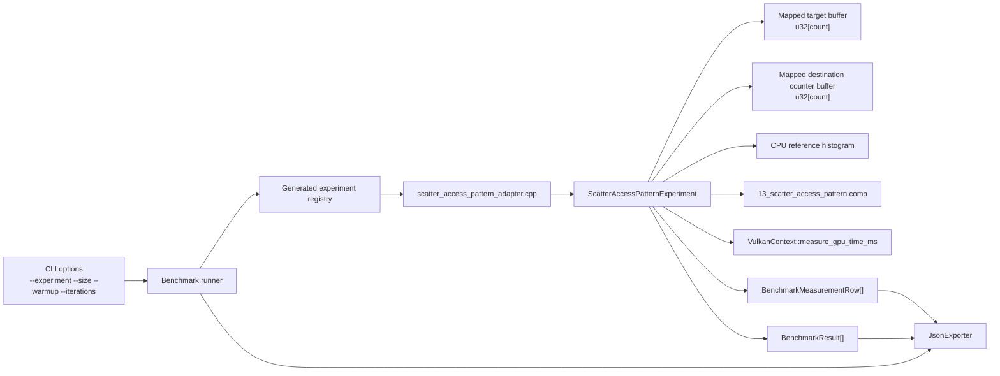
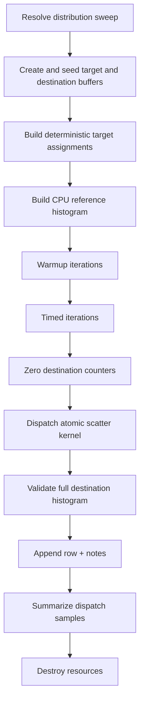
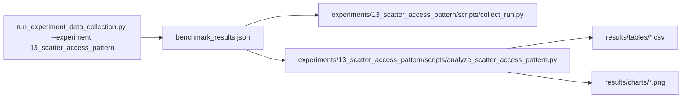

# Experiment 13 Scatter Access Pattern: Runtime Architecture

## 1. Purpose
Experiment 13 characterizes indirect indexed writes by varying the destination target distribution while keeping the kernel contract stable.

The benchmark isolates write-side contention and address disorder:
- every logical input performs exactly one scatter update
- the primary kernel uses `atomicAdd` so colliding variants stay correct
- arithmetic remains trivial
- dispatch shape remains fixed
- the only intended variable is the target distribution

The first implementation should stay narrow:
- no shared memory
- no subgroup operations
- no extra arithmetic payload
- no non-atomic colliding variants in the primary result set

## 2. Draft Runtime Contract
The first implementation should use one parameterized compute shader and one host-generated target buffer per case.

Host-configured inputs:
- `count`: logical element count
- `distribution`: scatter-pattern family
- `seed`: deterministic generation seed
- `collision_factor`: average writers per active target for reduced-target variants
- `hot_window_size`: hot-set width for clustered contention variants

Recommended variant set:
- `unique_permutation`
- `random_collision_x4`
- `clustered_hotset_32`

Distribution definitions:
- `unique_permutation`: `targets` is a deterministic permutation of `[0, count)`, so every destination is touched exactly once but in shuffled order
- `random_collision_x4`: the active destination set is reduced to approximately `count / 4`; target ids are repeated to create an average `4x` write fan-in per active target, then shuffled deterministically
- `clustered_hotset_32`: logical inputs are assigned to deterministic hot windows of `32` destinations, forcing repeated atomic updates into a small local target set before moving to another window

Logical data model:
- element type: `u32`
- target buffer length: `count`
- destination counter buffer length: `count`
- total logical traffic proxy per element: `3 * sizeof(uint32_t)` for one target read plus one atomic read-modify-write
- total transient allocation: approximately `2 * count * sizeof(uint32_t)` plus any Vulkan alignment slack

Allocation rule:
- `max_buffer_bytes` is a per-buffer cap inherited from `--size`
- a candidate point is valid only if `count * sizeof(uint32_t) <= max_buffer_bytes` for both the target buffer and destination counter buffer
- the host should skip or clamp invalid points rather than silently changing the distribution contract

Seeding rule:
- target generation is deterministic for a given `(distribution, seed, count)`
- the same generated target buffer is reused for warmup and timed iterations
- destination counters are reset to zero before every warmup and timed iteration

Per-invocation work:
- `logical_index = gl_GlobalInvocationID.x`
- return if `logical_index >= pc.count`
- `target_index = target_buffer.targets[logical_index]`
- return or flag failure if `target_index >= pc.target_capacity`
- `atomicAdd(dst_buffer.counters[target_index], 1u)`

Validation model:
- the full destination counter span is compared against a deterministic CPU reference histogram
- untouched destinations must remain zero
- target buffer contents must remain unchanged
- integer comparison is exact; no tolerance is required

Measurement model:
- workgroup size: `256`
- dispatch count: `1` per timed sample
- `variant` should encode the distribution, for example `unique_permutation`, `random_collision_x4`, `clustered_hotset_32`
- `problem_size` in output rows is the logical element count
- `throughput` is the primary rate metric
- `gbps` is retained as a logical traffic proxy and should not be interpreted as physical atomic bandwidth

## 3. Runtime Component Architecture


## 4. Resource Ownership Model
Pipeline resources:
- shader module
- descriptor set layout
- descriptor pool
- descriptor set
- pipeline layout
- compute pipeline

Buffer resources:
- one mapped target storage buffer
- one mapped destination counter storage buffer

Ownership rule:
- the experiment function creates and destroys all resources
- teardown is reverse-order
- Vulkan handles are reset to `VK_NULL_HANDLE`

## 5. Shader Layout
The shader should remain single-file and single-entry-point.

Recommended GLSL layout:
```glsl
#version 450

layout(local_size_x = 256, local_size_y = 1, local_size_z = 1) in;

layout(set = 0, binding = 0, std430) readonly buffer TargetBuffer {
    uint targets[];
} target_buffer;

layout(set = 0, binding = 1, std430) buffer DestinationCounterBuffer {
    uint counters[];
} dst_buffer;

layout(push_constant) uniform PushConstants {
    uint count;
    uint target_capacity;
} pc;

void main() {
    uint logical_index = gl_GlobalInvocationID.x;
    if (logical_index >= pc.count) {
        return;
    }

    uint target_index = target_buffer.targets[logical_index];
    if (target_index >= pc.target_capacity) {
        return;
    }

    atomicAdd(dst_buffer.counters[target_index], 1u);
}
```

Shader layout rules:
- keep target generation on the host so the shader only consumes the chosen distribution
- keep one atomic increment as the only side effect
- keep arithmetic trivial so write contention dominates the measurement
- keep bounds checks explicit
- avoid shared memory, subgroup ops, and extra control flow beyond the bounds checks

## 6. Execution Flow


## 7. Timing and Metrics Semantics
Per measured point:
- `gpu_ms`: dispatch-stage GPU timestamp duration only
- `end_to_end_ms`: host wall-clock around reset, dispatch, and validation
- `throughput`: logical scatter updates per second for the logical element count
- `gbps`: logical traffic proxy in bytes per second, using `3 * sizeof(uint32_t)` per logical update

Warmup iterations:
- executed per `(variant, problem_size)`
- timings are ignored and only used to stabilize pipeline and cache behavior

Timed iterations:
- one row is emitted per iteration
- a failed correctness check should flip the run-level success flag even if timing data was collected

## 8. Notes and Metadata
Per row notes should record:
- `distribution`
- `seed`
- `collision_factor`
- `hot_window_size`
- `target_capacity`
- `active_target_count`
- `logical_elements`
- `physical_elements`
- `physical_span_bytes`
- `bytes_per_logical_element`
- `validation_mode`
- `dispatch_ms_non_finite` when needed
- `correctness_mismatch` when needed

## 9. Data and Analysis Pipeline

