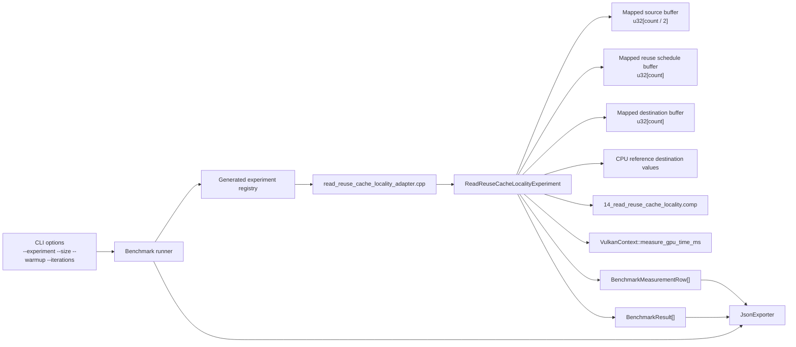
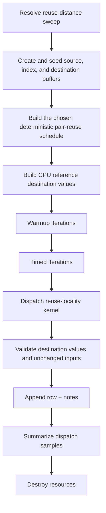
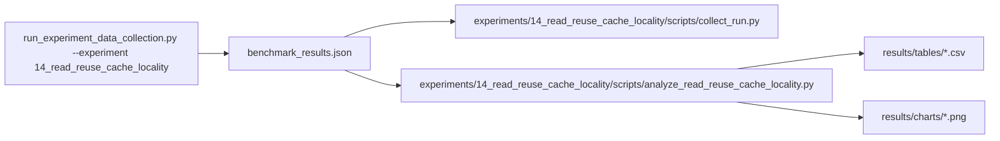

# Experiment 14 Read Reuse and Cache Locality: Runtime Architecture

## 1. Purpose
Experiment 14 characterizes temporal read locality by varying the distance between two reads of the same source element while keeping the per-invocation shader contract stable.

The benchmark isolates reuse-distance effects:
- every logical invocation performs one indexed source read
- every logical invocation performs one sequential destination write
- every unique source element is touched exactly twice per case
- arithmetic remains trivial
- dispatch shape remains fixed
- the only intended variable is the distance between the two touches

The first implementation should stay narrow:
- reuse a gather-style kernel rather than a same-thread reread loop
- keep the variation in host-generated schedules, not in shader control flow
- avoid shared memory, atomics, subgroup operations, and extra arithmetic payload

## 2. Draft Runtime Contract
The first implementation should use one parameterized compute shader and one host-generated index schedule per case.

Host-configured inputs:
- `count`: logical invocation count; must resolve to an even value
- `reuse_distance`: paired reread distance expressed in scheduled reads
- `source_count`: derived as `count / 2`

Recommended variant set:
- `reuse_distance_1`
- `reuse_distance_32`
- `reuse_distance_256`
- `reuse_distance_4096`
- `reuse_distance_full_span`

Reuse schedule definitions:
- `reuse_distance_1`: the index schedule is `[0, 0, 1, 1, 2, 2, ...]`
- `reuse_distance_32`: the schedule emits 32 unique indices and then replays the same 32 indices before advancing
- `reuse_distance_256`: the schedule emits 256 unique indices and then replays the same 256 indices before advancing
- `reuse_distance_4096`: the schedule emits 4096 unique indices and then replays the same 4096 indices before advancing
- `reuse_distance_full_span`: the schedule performs one full sequential pass over the unique source span and then repeats that span once

Logical data model:
- element type: `u32`
- source buffer length: `count / 2`
- index buffer length: `count`
- destination buffer length: `count`
- total logical traffic proxy per invocation: `3 * sizeof(uint32_t)` for one index read, one source read, and one destination write
- total transient allocation: approximately `((count / 2) + count + count) * sizeof(uint32_t)` plus any Vulkan alignment slack

Allocation rule:
- `max_buffer_bytes` is a per-buffer cap inherited from `--size`
- a candidate point is valid only if `(count / 2) * sizeof(uint32_t) <= max_buffer_bytes` for the source buffer and `count * sizeof(uint32_t) <= max_buffer_bytes` for the index and destination buffers
- the host should round the derived logical count down to the nearest even value and record that adjustment in row notes when it occurs

Schedule generation rule:
- source values are deterministic for a given `source_count`
- every source index appears exactly twice in the index schedule
- the same generated index schedule is reused for warmup and timed iterations
- block-based schedules should preserve contiguous first-touch order inside each block so temporal spacing, not address disorder, remains the primary variable

Per-invocation work:
- `logical_index = gl_GlobalInvocationID.x`
- return if `logical_index >= pc.count`
- `source_index = index_buffer.indices[logical_index]`
- return if `source_index >= pc.source_count`
- `value = src_buffer.values[source_index]`
- `dst_buffer.values[logical_index] = value + 1u`

Validation model:
- destination values must match `src_buffer[index_buffer[i]] + 1u` exactly
- source and index buffers must remain unchanged
- integer comparison is exact; no tolerance is required

Measurement model:
- workgroup size: `256`
- dispatch count: `1` per timed sample
- `variant` should encode the reuse schedule, for example `reuse_distance_32`
- `problem_size` in output rows is the logical invocation count
- `throughput` is logical source reads per second
- `gbps` should be derived from logical bytes moved, not from padded allocation size

## 3. Runtime Component Architecture


## 4. Resource Ownership Model
Pipeline resources:
- shader module
- descriptor set layout
- descriptor pool
- descriptor set
- pipeline layout
- compute pipeline

Buffer resources:
- one mapped source storage buffer
- one mapped index schedule storage buffer
- one mapped destination storage buffer

Ownership rule:
- the experiment function creates and destroys all resources
- teardown is reverse-order
- Vulkan handles are reset to `VK_NULL_HANDLE`

## 5. Shader Layout
The shader should remain single-file and single-entry-point.

Recommended GLSL layout:
```glsl
#version 450

layout(local_size_x = 256, local_size_y = 1, local_size_z = 1) in;

layout(set = 0, binding = 0, std430) readonly buffer SourceBuffer {
    uint values[];
} src_buffer;

layout(set = 0, binding = 1, std430) readonly buffer IndexBuffer {
    uint indices[];
} index_buffer;

layout(set = 0, binding = 2, std430) writeonly buffer DestinationBuffer {
    uint values[];
} dst_buffer;

layout(push_constant) uniform PushConstants {
    uint count;
    uint source_count;
} pc;

void main() {
    uint logical_index = gl_GlobalInvocationID.x;
    if (logical_index >= pc.count) {
        return;
    }

    uint source_index = index_buffer.indices[logical_index];
    if (source_index >= pc.source_count) {
        return;
    }

    uint value = src_buffer.values[source_index];
    dst_buffer.values[logical_index] = value + 1u;
}
```

Shader layout rules:
- keep the reuse schedule host-generated so the shader only consumes the chosen locality pattern
- keep the arithmetic trivial so the memory access schedule dominates the measurement
- keep the destination write sequential so the studied variable remains read-side reuse distance
- use exact integer validation for all runs
- avoid loop-based reread logic in the primary path so compiler register reuse does not become the main explanation

## 6. Execution Flow


## 7. Timing and Metrics Semantics
Per measured point:
- `gpu_ms`: dispatch-stage GPU timestamp duration only
- `end_to_end_ms`: host wall-clock around dispatch and validation
- `throughput`: logical reads per second for the logical invocation count
- `gbps`: logical bytes moved per second, with `3 * sizeof(uint32_t)` per logical invocation

Warmup iterations:
- executed per `(variant, problem_size)`
- timings are ignored and only used to stabilize pipeline and cache behavior

Timed iterations:
- one row is emitted per iteration
- a failed correctness check should flip the run-level success flag even if timing data was collected

## 8. Notes and Metadata
Per row notes should record:
- `reuse_variant`
- `reuse_distance_reads`
- `pair_block_size`
- `pair_reuse_count`
- `source_unique_elements`
- `source_span_bytes`
- `index_span_bytes`
- `logical_elements`
- `physical_elements`
- `bytes_per_logical_element`
- `validation_mode`
- `logical_count_adjusted_to_even` when needed
- `dispatch_ms_non_finite` when needed
- `correctness_mismatch` when needed

## 9. Data and Analysis Pipeline

