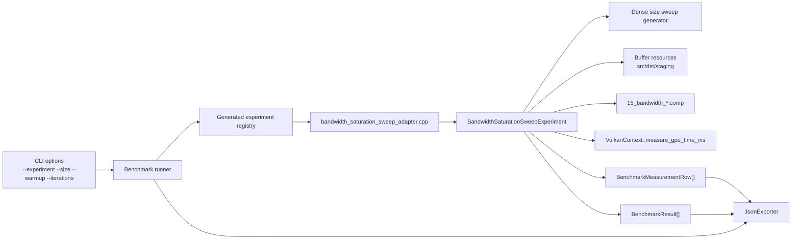
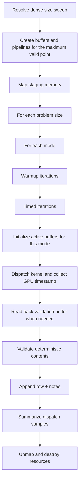
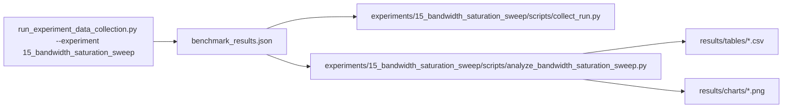

# Experiment 15 Bandwidth Saturation Sweep: Runtime Architecture

## 1. Purpose
Experiment 15 characterizes when simple contiguous memory kernels transition from launch-overhead-bound behavior into a
sustained bandwidth regime as problem size grows.

The benchmark isolates size-scaling effects:
- every logical invocation uses the same contiguous global index mapping
- memory behavior stays limited to simple `read_only`, `write_only`, and `read_write_copy` kernels
- arithmetic remains trivial
- dispatch shape remains fixed
- the only intended primary variable is problem size

The first implementation should stay narrow:
- reuse the Experiment 03-style contiguous memory modes rather than introducing new indexing behavior
- keep one dispatch per timed sample
- avoid shared memory, subgroup operations, atomics, extra arithmetic payload, and multi-dispatch pipelining
- keep plateau estimation in analysis scripts rather than branching runtime behavior on a guessed saturation point

## 2. Draft Runtime Contract
The first implementation should use three simple compute shaders and one host-generated dense size sweep.

Host-configured inputs:
- `count`: logical element count derived from each size point
- `mode`: memory behavior family
- `max_buffer_bytes`: per-buffer cap inherited from `--size`

Recommended variant set:
- `read_only`
- `write_only`
- `read_write_copy`

Size sweep definition:
- `1 MiB`, `2 MiB`, `4 MiB`, `8 MiB`, `16 MiB`, `24 MiB`, `32 MiB`, `48 MiB`, `64 MiB`, `96 MiB`, `128 MiB`,
  `192 MiB`, `256 MiB`, `384 MiB`, `512 MiB`, `768 MiB`, `1 GiB`
- the host should drop points that violate either the active per-buffer size cap or `maxComputeWorkGroupCount[0]`
- the realized sweep should be recorded in run metadata so plateau conclusions stay tied to the actual tested range

Logical data model:
- element type: `float`
- source buffer length: `count` for `read_only` and `read_write_copy`
- destination buffer length: `count` for `write_only` and `read_write_copy`
- staging buffer length: sized for the largest valid point used for initialization and validation
- logical bytes per element:
  - `read_only`: `sizeof(float)`
  - `write_only`: `sizeof(float)`
  - `read_write_copy`: `2 * sizeof(float)`

Allocation rule:
- `max_buffer_bytes` is enforced per logical storage buffer, not as a combined budget
- a candidate point is valid only if every active logical buffer for that mode fits within `max_buffer_bytes`
- the host should clamp the realized sweep rather than silently altering the per-element contract

Initialization rule:
- source values follow the same deterministic float pattern used by Experiment 03
- write-only and copy destination buffers are reset to deterministic sentinel values before validation-sensitive runs
- the same generated contents are reused for warmup and timed iterations apart from required destination resets

Per-invocation work:
- `read_only`:
  - `logical_index = gl_GlobalInvocationID.x`
  - return if `logical_index >= pc.count`
  - read `src.values[logical_index]` through a `volatile` storage declaration so the load remains observable
- `write_only`:
  - `logical_index = gl_GlobalInvocationID.x`
  - return if `logical_index >= pc.count`
  - write `dst.values[logical_index] = float(logical_index)`
- `read_write_copy`:
  - `logical_index = gl_GlobalInvocationID.x`
  - return if `logical_index >= pc.count`
  - write `dst.values[logical_index] = src.values[logical_index]`

Validation model:
- `read_only`: validate that the source buffer remains unchanged after dispatch
- `write_only`: validate that the destination buffer contains `float(index)` exactly
- `read_write_copy`: validate that the destination buffer matches the deterministic source pattern exactly
- float validation is exact because the patterns are integer-representable in `float`

Measurement model:
- workgroup size: `256`
- dispatch count: `1` per timed sample
- `variant` should encode the memory mode
- `problem_size` in output rows is the logical element count
- `throughput` is the primary rate metric in logical elements per second
- `gbps` is derived from logical bytes moved per element for the chosen mode

## 3. Runtime Component Architecture


## 4. Resource Ownership Model
Shared buffers:
- `src_device` for `read_only` and `read_write_copy`
- `dst_device` for `write_only` and `read_write_copy`
- `staging` for deterministic initialization and validation readback

Per-mode pipeline resources:
- shader module
- descriptor set layout
- descriptor pool
- descriptor set
- pipeline layout
- compute pipeline

Ownership rule:
- the experiment function creates and destroys all resources
- teardown is reverse-order
- Vulkan handles are reset to `VK_NULL_HANDLE`

## 5. Shader Layout
The shaders should stay single-file and single-entry-point, with unique Experiment 15 basenames.

`15_bandwidth_read_only.comp`
```glsl
#version 450

layout(local_size_x = 256, local_size_y = 1, local_size_z = 1) in;

layout(std430, binding = 0) readonly volatile buffer Source {
    float values[];
} src;

layout(push_constant) uniform Params {
    uint element_count;
} params;

void main() {
    uint id = gl_GlobalInvocationID.x;
    if (id >= params.element_count) {
        return;
    }

    float value = src.values[id];
    if (value > 1.0e38) {
        return;
    }
}
```

`15_bandwidth_write_only.comp`
```glsl
#version 450

layout(local_size_x = 256, local_size_y = 1, local_size_z = 1) in;

layout(std430, binding = 0) writeonly buffer Destination {
    float values[];
} dst;

layout(push_constant) uniform Params {
    uint element_count;
} params;

void main() {
    uint id = gl_GlobalInvocationID.x;
    if (id >= params.element_count) {
        return;
    }

    dst.values[id] = float(id);
}
```

`15_bandwidth_read_write_copy.comp`
```glsl
#version 450

layout(local_size_x = 256, local_size_y = 1, local_size_z = 1) in;

layout(std430, binding = 0) readonly buffer Source {
    float values[];
} src;

layout(std430, binding = 1) writeonly buffer Destination {
    float values[];
} dst;

layout(push_constant) uniform Params {
    uint element_count;
} params;

void main() {
    uint id = gl_GlobalInvocationID.x;
    if (id >= params.element_count) {
        return;
    }

    dst.values[id] = src.values[id];
}
```

Shader layout rules:
- keep indexing fully contiguous
- keep arithmetic trivial so memory traffic dominates the measurement
- keep bounds checks explicit
- use `volatile` on the read-only path so the load remains observable
- avoid extra branches, loops, or synchronization

## 6. Execution Flow


## 7. Timing and Metrics Semantics
Per measured point:
- `gpu_ms`: dispatch-stage GPU timestamp duration only
- `end_to_end_ms`: host wall-clock around setup, dispatch, readback, and validation
- `throughput`: logical elements per second for the active problem size
- `gbps`: logical bytes moved per second using the mode-specific bytes-per-element contract

Warmup iterations:
- executed per `(variant, problem_size)`
- timings are ignored and only used to stabilize pipeline and cache behavior

Timed iterations:
- one row is emitted per iteration
- a failed correctness check should flip the run-level success flag even if timing data was collected
- plateau onset is derived later from summarized median curves, not per-iteration runtime branching

## 8. Notes and Metadata
Per row notes should record:
- `mode`
- `size_bytes`
- `size_mib`
- `logical_elements`
- `bytes_per_element`
- `local_size_x`
- `group_count_x`
- `validation_mode`
- `dispatch_ms_non_finite` when needed
- `correctness_mismatch` when needed

## 9. Data and Analysis Pipeline

