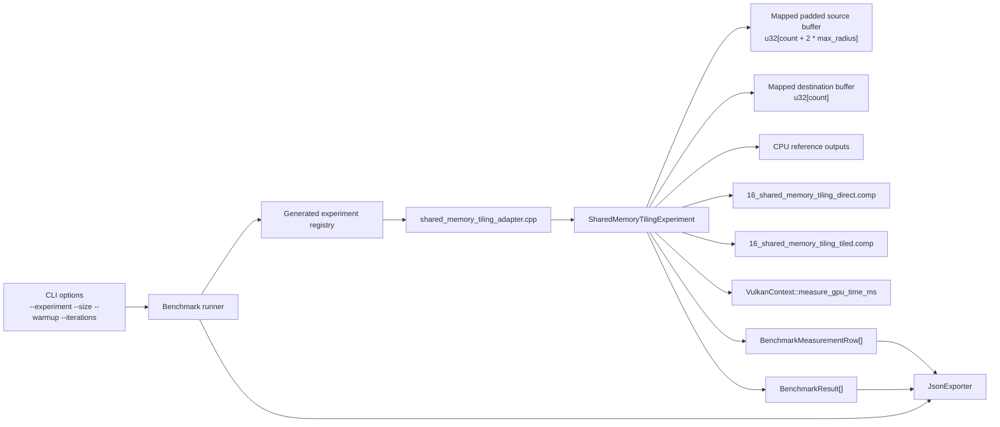
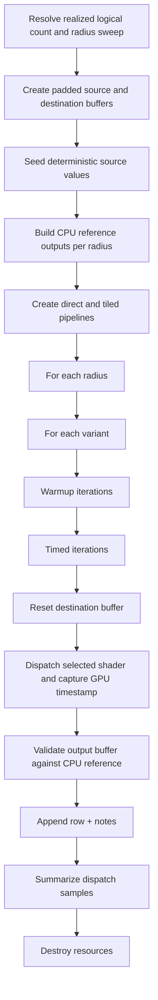
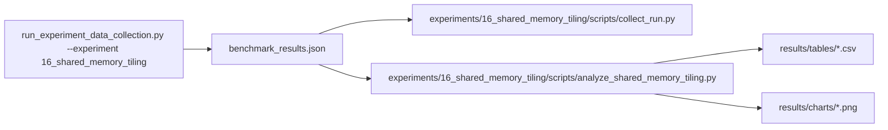

# Experiment 16 Shared Memory Tiling: Runtime Architecture

## 1. Purpose
Experiment 16 characterizes when explicit workgroup-memory staging beats repeated direct global reads for an
overlapping-neighborhood workload.

The benchmark isolates reuse-versus-synchronization tradeoffs:
- every logical invocation produces one stencil output
- arithmetic remains a simple integer neighborhood sum
- dispatch shape remains fixed
- the intended variables are implementation strategy and reuse radius

The first implementation should stay narrow:
- use a 1D stencil rather than a 2D image-style tile
- keep `local_size_x` fixed at `256`
- compare two explicit shader paths: `direct_global` and `shared_tiled`
- keep the tile-size sweep out of this experiment so Experiment 17 can study it separately
- avoid atomics, subgroup operations, extra arithmetic payload, and multi-dispatch pipelines

## 2. Draft Runtime Contract
The first implementation should use two compute shaders and one host-controlled radius sweep.

Host-configured inputs:
- `count`: logical output element count
- `radius`: neighborhood radius
- `max_buffer_bytes`: per-buffer cap inherited from `--size`
- `center_offset`: fixed source-padding offset equal to `kMaxRadius`

Recommended variant set:
- `direct_global`
- `shared_tiled`

Recommended radius sweep:
- `1`
- `4`
- `8`
- `16`

Logical data model:
- element type: `u32`
- `kWorkgroupSize = 256`
- `kMaxRadius = 16`
- padded source buffer length: `count + 2 * kMaxRadius`
- destination buffer length: `count`
- logical output `i` reads a neighborhood centered at `src[i + center_offset]`
- direct-path logical traffic per output: `2 * radius + 1` source reads plus one destination write
- tiled-path estimated global traffic per full workgroup: `kWorkgroupSize + 2 * radius` source reads plus one
  destination write per output

Allocation rule:
- `max_buffer_bytes` is treated as a per-buffer cap, matching the existing experiment contract
- a candidate point is valid only when the padded source buffer and the destination buffer both fit within
  `max_buffer_bytes`
- the realized logical count should be rounded down to a multiple of `kWorkgroupSize` so every workgroup is full and
  the tiled path never needs a tail-special-case load path
- the host should drop or clamp points that exceed `maxComputeWorkGroupCount[0]`

Initialization rule:
- source values use a deterministic bounded `u32` pattern so exact integer validation is safe
- destination values are reset to a deterministic sentinel or zero pattern before each warmup and timed iteration
- the same source data is reused across warmup and timed iterations

Per-invocation work:
- `direct_global`:
  - `logical_index = gl_GlobalInvocationID.x`
  - return if `logical_index >= count`
  - `center = logical_index + center_offset`
  - sum `src[center - radius ... center + radius]`
  - write the accumulated sum to `dst[logical_index]`
- `shared_tiled`:
  - `logical_index = gl_GlobalInvocationID.x`
  - `local_index = gl_LocalInvocationID.x`
  - `group_start = gl_WorkGroupID.x * kWorkgroupSize`
  - `tile_start = group_start + center_offset - radius`
  - cooperatively load `kWorkgroupSize + 2 * radius` source elements into workgroup memory
  - execute exactly one workgroup barrier
  - return if `logical_index >= count`
  - sum from the staged tile and write the accumulated sum to `dst[logical_index]`

Validation model:
- destination values must match a deterministic CPU stencil reference exactly for every output element
- source values must remain unchanged after dispatch
- integer comparison is exact; no tolerance is required

Measurement model:
- workgroup size: `256`
- dispatch count: `1` per timed sample
- `problem_size` in output rows is the logical output count
- `variant` should encode both implementation and radius, for example `direct_global_r1`, `shared_tiled_r1`,
  `direct_global_r8`
- `throughput` is logical stencil outputs per second
- `gbps` should be derived from variant-specific estimated global bytes moved per dispatch, not from the padded logical
  neighborhood size alone

## 3. Runtime Component Architecture


## 4. Resource Ownership Model
Direct-path pipeline resources:
- shader module
- descriptor set layout
- descriptor pool
- descriptor set
- pipeline layout
- compute pipeline

Tiled-path pipeline resources:
- shader module
- descriptor set layout
- descriptor pool
- descriptor set
- pipeline layout
- compute pipeline

Buffer resources:
- one mapped padded source storage buffer
- one mapped destination storage buffer

Ownership rule:
- the experiment function creates and destroys all resources
- teardown is reverse-order
- Vulkan handles are reset to `VK_NULL_HANDLE`

## 5. Shader Layout
The first implementation should use two single-entry-point shaders so the comparison does not depend on a runtime
branch inside one module.

`16_shared_memory_tiling_direct.comp`
```glsl
#version 450

layout(local_size_x = 256, local_size_y = 1, local_size_z = 1) in;

layout(set = 0, binding = 0, std430) readonly buffer SourceBuffer {
    uint values[];
} src_buffer;

layout(set = 0, binding = 1, std430) writeonly buffer DestinationBuffer {
    uint values[];
} dst_buffer;

layout(push_constant) uniform PushConstants {
    uint output_count;
    uint radius;
    uint center_offset;
} pc;

void main() {
    uint logical_index = gl_GlobalInvocationID.x;
    if (logical_index >= pc.output_count) {
        return;
    }

    uint center = logical_index + pc.center_offset;
    uint sum = 0u;
    for (int delta = -int(pc.radius); delta <= int(pc.radius); ++delta) {
        sum += src_buffer.values[center + delta];
    }
    dst_buffer.values[logical_index] = sum;
}
```

`16_shared_memory_tiling_tiled.comp`
```glsl
#version 450

layout(local_size_x = 256, local_size_y = 1, local_size_z = 1) in;

const uint kWorkgroupSize = 256u;
const uint kMaxRadius = 16u;
shared uint tile[kWorkgroupSize + 2u * kMaxRadius];

layout(set = 0, binding = 0, std430) readonly buffer SourceBuffer {
    uint values[];
} src_buffer;

layout(set = 0, binding = 1, std430) writeonly buffer DestinationBuffer {
    uint values[];
} dst_buffer;

layout(push_constant) uniform PushConstants {
    uint output_count;
    uint radius;
    uint center_offset;
} pc;

void main() {
    uint global_index = gl_GlobalInvocationID.x;
    uint local_index = gl_LocalInvocationID.x;
    uint group_start = gl_WorkGroupID.x * kWorkgroupSize;
    uint tile_start = group_start + pc.center_offset - pc.radius;
    uint active_tile_span = kWorkgroupSize + 2u * pc.radius;

    for (uint load_index = local_index; load_index < active_tile_span; load_index += kWorkgroupSize) {
        tile[load_index] = src_buffer.values[tile_start + load_index];
    }

    barrier();

    if (global_index >= pc.output_count) {
        return;
    }

    uint sum = 0u;
    for (uint offset = 0u; offset < 2u * pc.radius + 1u; ++offset) {
        sum += tile[local_index + offset];
    }
    dst_buffer.values[global_index] = sum;
}
```

Shader layout rules:
- keep the source-padding contract explicit through `center_offset`
- keep `kMaxRadius` fixed in the first draft so one tiled shader can serve the full radius sweep
- record both `active_tile_span_elements` and `shared_allocated_bytes_per_workgroup` in row notes, because the active
  halo width varies but the allocated shared array is fixed to the max-radius contract
- keep exactly one barrier in the tiled path
- keep arithmetic identical between direct and tiled variants
- avoid extra branches, atomics, subgroup ops, and extra arithmetic payload

## 6. Execution Flow


## 7. Timing and Metrics Semantics
Per measured point:
- `gpu_ms`: dispatch-stage GPU timestamp duration only
- `end_to_end_ms`: host wall-clock around destination reset, dispatch, and validation
- `throughput`: logical stencil outputs per second for the active problem size
- `gbps`: estimated global bytes moved per second using the active variant contract

Suggested byte model:
- `direct_global` estimated bytes per dispatch:
  - `count * ((2 * radius + 1) + 1) * sizeof(uint32_t)`
- `shared_tiled` estimated bytes per dispatch:
  - `group_count_x * (kWorkgroupSize + 2 * radius) * sizeof(uint32_t)` source reads
  - plus `count * sizeof(uint32_t)` destination writes

Warmup iterations:
- executed per `(variant, radius, problem_size)`
- timings are ignored and only used to stabilize pipeline and cache behavior

Timed iterations:
- one row is emitted per iteration
- a failed correctness check should flip the run-level success flag even if timing data was collected

## 8. Notes and Metadata
Per row notes should record:
- `implementation`
- `reuse_radius`
- `center_offset`
- `local_size_x`
- `group_count_x`
- `source_padded_elements`
- `output_elements`
- `active_tile_span_elements`
- `shared_allocated_bytes_per_workgroup`
- `barriers_per_workgroup`
- `estimated_global_read_bytes`
- `estimated_global_write_bytes`
- `validation_mode`
- `logical_count_rounded_to_workgroup_multiple` when needed
- `dispatch_ms_non_finite` when needed
- `correctness_mismatch` when needed

## 9. Data and Analysis Pipeline

